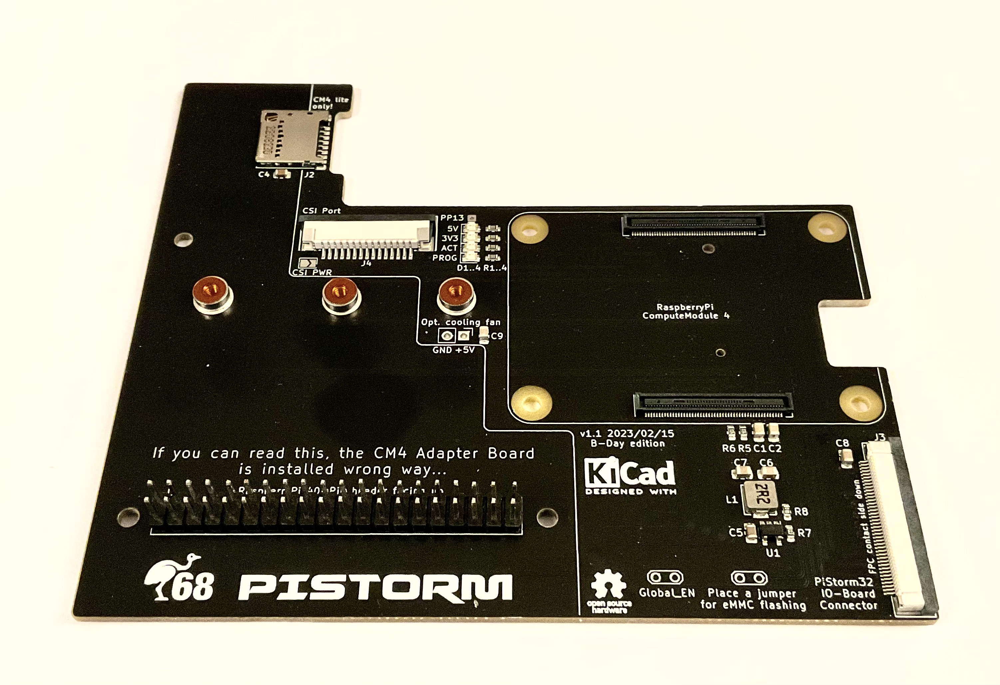
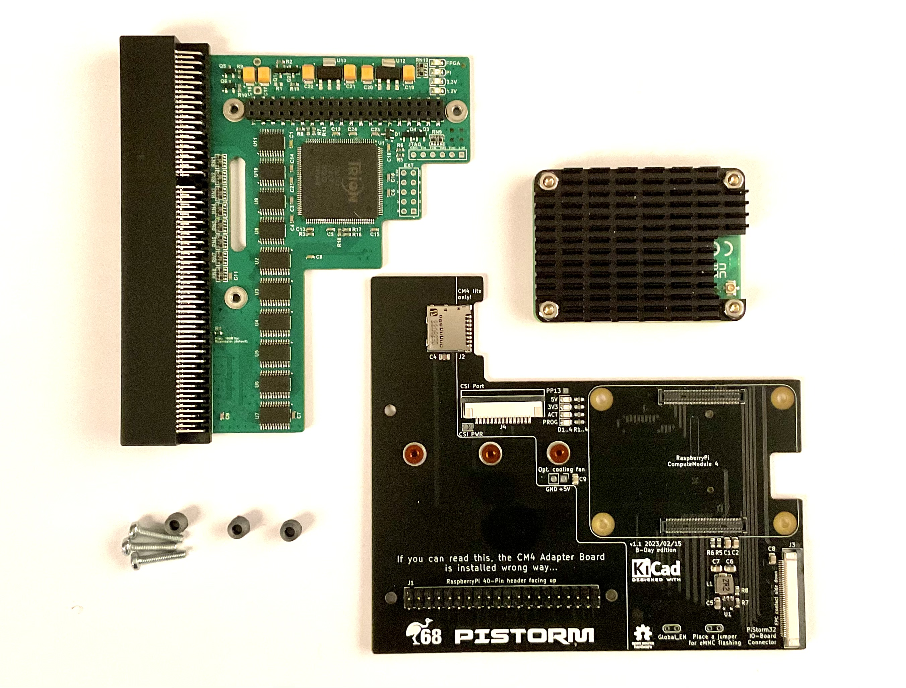
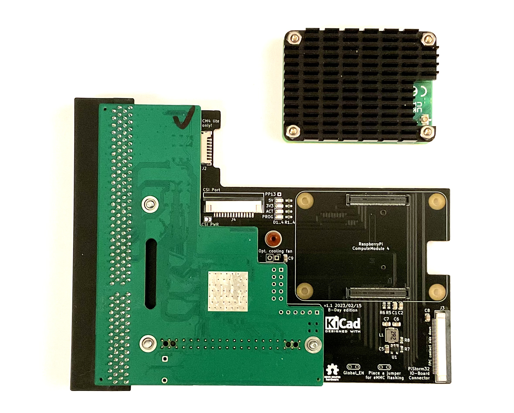
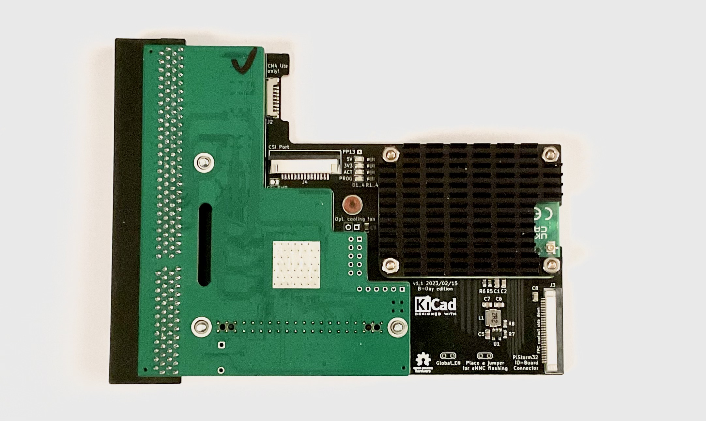

# CM4 for PiStorm32-Lite

This is the v1.1 "B-Day edition" of CM4 adapter board designed especially for PiStorm32-Lite. The adapter has following features

- CM4 connector, cutout for onboard WiFi antenna, four holes for mechanical fastening of the CM4
- microSD slot usable with Lite versions of CM4 board
- PP13 pad with the same function as in case of RaspberryPi 3
- Global_EN jumper for physically resetting the CM4
- Jumper for forced flashing of eMMC memory (if available)
- CSI port for future uses, such as RGB grabber
- 40-pin FPC port for peripherals: HDMI, Ethernet, USB, I2C
- NVMe slot on bottom side for further use as mass storage on AmigaOS

## Building instructions

For building of CM4 version of PiStorm32-lite you need following components

- PiStorm32-lite board
- CM4 Adapter (this project)
- Three 5mm spacers (STL file included in FabricationData folder)
- Three M2,5x10 screws
- CM4 Module with a heatsink

The heatsink is in case of CM4 mandatory! The module has to small PCB area to dissipate the heat from the BRCM2711 alone. Not using heatsink will not damage your CM4 but it will almost immedaitely heat up to 80°C and throttle. If you decide to print the spacers by yourself, use for your safety a material which is a bit more heat resistant than commonly used PLA.

If you need to attach a CM4 heatsink with fan, solder either wires or 2x1 pin header in the "opt. cooling fan" position. If you are using a fan with PWM control, followi instructions of the supplier on how to connect it to a system providing the power only, without PWM pulsing or tacho signal. If you are using IDE LED as indicator of microSD or eMMC on CM4, solder the LED controller of your choise to the PP13 pad. This pad has the same meaning as on RaspberryPi 3 boards. Inactive state results in a 3.3V on that pin, active microSD/eMMC lits the "ACT" LED on and the voltage on PP13 drops to about 2V.

Subsequently connect the 40-pin connector of PiStorm32-Lite with pinheader of the CM4 Adapter board. The top sides of both boards are placed face-to-face to each other. Carefully insert the spacers and tighten the boards together using the M2,5 screws. The assembled PiStorm should look like this

Finally, plug the CM4 into the socket on CM4 Adapter board. Your PiStorm32-Lite with RaspberryPi Compute Module 4 is now ready and can be installed in your Amiga.

### WARNING
**NEVER EVER** attempt to fix CM4 to the CM4 Adapter board using the four screws **without** small spacers provided by the manufacturer of the heatsink. These circa 1mm tall spacers are made of a hard rubber which prevents bendig of CM4 board and reduces the pressure exposed to the CM4. Tightening CM4 **without** the hard rubber spacers will most likely **damage** CM4 board and the CM4 Adapter board.

Please follow the installation manuals provided with your CM4 heatsink precisely.

### NOTES

Please note the 40-pin header on CM4 adapter board is installed "upside-down", i.e. the top of the CM4 adapter corresponds to bottom side of regular RaspberryPi. 

If HDMI output is wished, an IO board needs to be connected to the CM4 adapter board using 40-pin FPC cable.

 

## Ordering instructions

TBD...
